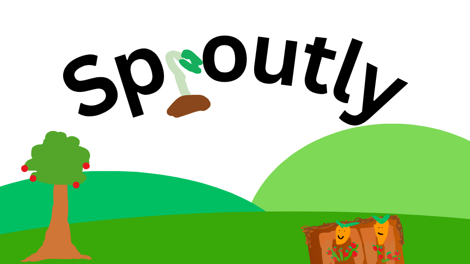

# Sproutly

**Sproutly** is a simple and fun web app that lets you grow a virtual garden (IT grows even when you're **OFFLINE!**). Whether you love plants or just want to learn how gardening works, Sproutly helps you grow, care for, and enjoy your own little garden online.

---

## What is Sproutly?

To find out simply visit my new homepage explaining everything! (Pictures coming soon)
---

## Photos

### ignore

### ignore

### ignore

---

## Try It Out

Sproutly works in your browser. No downloads, no accounts. Just start planting and enjoy your garden.

---

## Coming Soon

- Making a homescreen
- Making the garden grid and making everything work
- Adding the seed shop and the seller
- Making Sproukels
- New plant types
- Garden sharing with friends  
- Weather effects

---

## License

This project is open source and free to use.

---

## Credits

This project was inspired by the roblox game "Grow a Garden"

